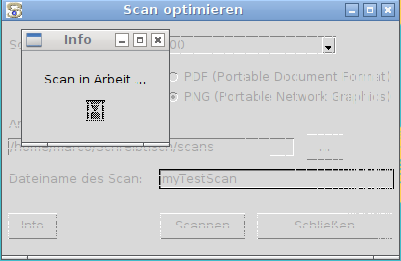
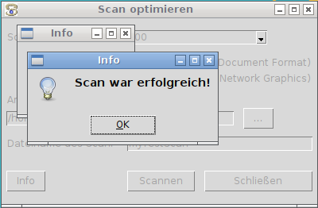

# scanoptimizer


A helper for a one-click-approach to scanning, file size reduction and 
converting scans into PDF under LINUX (e.g. Debian) operating systems.

[![MIT License][LICENSE-BADGE]](LICENSE)
![Python 3.x][PYTHON-BADGE]

[LICENSE-BADGE]: https://img.shields.io/badge/license-MIT-blue.svg
[PYTHON-BADGE]: https://img.shields.io/badge/Python-3.x-blue.svg


## Contents

* [Introduction](#introduction)
* [Preconditions](#preconditions)
* [Get Started](#get-started)
* [Using the GUI](#using-the-gui)
* [Best Practices](#best-practices)
* [Further reading](docs/scan_optimieren.md)
* [License](#license)


## Introduction

Scanning under LINUX systems is something not really good supported. I have 
always got some kind of jealous about WINDOWS or MAC users: They just put their 
document to scan onto their scanner, open any Scanning Software, push a button
and then the scan starts and after a moment a well sized PDF file of the
scan is available on the file system.

I always wanted the same comfort!
Over years of collecting knowledge about tweaking images with the help of
command line tools like `ImageMagick` and some better understanding of shell
scripting, Python scripting and `tkinter`, I was finally able to create this
tool.

The scan helper solution consist mainly of two scripts, `scan_and_optimize.sh` 
and `scanopt_gui.py`.

`scan_and_optimize.sh` does already everything from a command line perspective.
information of how to adopt the script to the needs of your available scanner
model can be found inside the comment of the source code.

`scanopt_gui.py` is just a user friendly interface of the shell script with
little additional functionality, like saving and reading the last settings to
a configuration file. The configuration file is saved to the users `HOME`, so 
every user on a system has his own settings, separated from the others.

Moreover with `scanopt_gui.desktop` exists a configuration for your LINUX 
desktop menu so it appears as a menu item under the group `grafics` or 
`utilities`.

You are welcome and feel free to install and use this tool!


## Preconditions

Preconditions (on Debian like systems):

1. SANE is installed:
   ```
   $> sudo apt-get install libsane
   ```

2. ImageMagick is installed:
   ```
   $> sudo apt-get install imagemagick
   ```

3. "PDF Split and Merge" (pdfsam) is installed:
   ```
   $> sudo apt-get install pdfsam
   ```

4. Python 3.x with `tkinter` is available on your system
   ```
   $> sudo apt-get install python3-dev python3-pip python3-tk
   ```


## Get Started

Installing on Debian like systems:

1. Copy file scanopt_gui.desktop into directory `/usr/share/applications/` if
   available for all users or into directory `~/.local/share/applications/` if
   only available for current local user

   * for all users:
     ```
     $> sudo cp scanopt_gui.desktop /usr/share/applications/
     ```
   * or for local user only:
     ```
     $> cp scanopt_gui.desktop ~/.local/share/applications/
     ```

   then for refreshing all program starter icons in the menu, run following
   command:
   ```
   $> lxpanelctl restart
   ```
   if this does not work, i.e. program starter icon in the panel menu not yet visible, then try this:
   ```
   $> kill `pidof lxpanel`
   $> setsid lxpanel -p LXDE &>/dev/null
   ```

2. Create a new directory for program files in `/opt/` and copy all files into it
   ```
   $> sudo mkdir /opt/scanopt
   $> sudo cp scanopt_gui.py /opt/scanopt
   $> sudo cp scan_and_optimize.sh /opt/scanopt
   $> sudo chmod 775 /opt/scanopt/scan_and_optimize.sh
   $> sudo cp README.md /opt/scanopt
   $> sudo cp LICENSE /opt/scanopt
   $> sudo cp scanopt_gui.desktop /opt/scanopt
   $> sudo cp scanopt_gui.gif /opt/scanopt
   ```

3. Optionally extend `PATH` variable of your local user profile (`~/.profile`)
   open your profile file with a text editor (e.g. `vi`) and insert following
   line at the end:
   ```
   PATH="/opt/scanopt:$PATH"
   ```

4. Switch-on your scanner and then run on command line the command:
   ```
   $> scan_and_optimize.sh --help
   ```
   follow then the instructions under topic `Hints` below


Hints:

1. for getting a list of available local scan devices, run on command line:
   ```
   $> scanimage --list-devices
   ```
   This works only if your scanner is connected to your system via USB, LAN or
   WLAN and it has to be switched on!

2. for getting a list of available scan options for a certain scan device,
   run on command line:
   ```
   $> scanimage --help --device-name DEVICE
   ```

   example:
   ```
   $> scanimage --help --device-name 'hpaio:/usb/Officejet_Pro_8600?serial=CN2C1CXJGN05KC'
   ```


## Using the GUI

Open the application from the Panel's application menu.


Clicking on the menu entry, it opens up the application and you see the 
application's main dialog.


If you run the application for the first time, you will get for all scanning
parameters the default values. Whenever you close the application it will save
all parameters into a file in your users home directory called `.scan_and_optimize`.
On every application start it will read from this file - if it exists - the 
settings from your previous session. In case you want to restore the initial 
default settings, just delete the file `.scan_and_optimize` in your users home
directory.

You can adjusted the scan parameters as needed. Most of the times you will set
the `Arbeitsverzeichnis` (working directory) where all your scan results will
be placed into and `Dateiname des Scan` for the file name of the scan without 
extension, because it will get used for several temporay files of the current 
scan. Pushing the button `...` will open the *directory chooser dialog*.


Just chose a directory for your *working directory* and conform it. The 
name of the currently chosen *working directory* will be shown in the disabled
label box.

After pushing the button `Scannen` the scan process will get started.

While the scan is in progress you will see a busy dialog and none of the settings can 
get changed.



If the scan ended successfully you will get a success info.



In case of an error you will get an error message from the system in an error 
dialog. Most of the times errors occure when the scanner is either not connected
to the computer or not switched on or just nor ready yet for scanning operation.


The Button `Info` will show you the current programm version.


## Best Practices

If you just want to scan a single page document for archiving reasons, e.g. you
want a readable digital copy of an original document with the smallest file size
then do the following settings:
*   set `Scan-Auflösung [dpi]` to `200`
*   set `Dateiformat` to `PDF`

If you want to scan a document with multiple pages


## License

This is free and open source software. You can use, copy, modify,
merge, publish, distribute, sublicense, and/or sell copies of it,
under the terms of the [MIT License](LICENSE).

This software is provided "AS IS", WITHOUT WARRANTY OF ANY KIND,
express or implied. See the [MIT License](LICENSE) for details.
